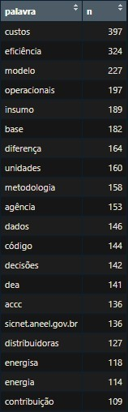

# Introduction

So, on my first internship, I worked at a virtual marketing company, in a business intelligence team. The project where I was allocated at had the main goal of determining, by Search Engine Optimization standards, some characteristics of our client. I’m not going to talk much about it, so the company product can be kept secret, but I want to explain that these techniques I’m going to show here are the results of my own studies, research, and try and error. At first, I developed and implemented this analysis in order to have some extra insights about my data, but after a while, I use it to gain strategic advantages in the project development and also to minimize the overall time to 1/3 of its total length. The majority of the time, I was working on the code only in my free time, or when I had no tasks to do.

Since I don’t want to do the exactly project that I developed in the internship, I’m going to show the main techniques that I used, but applied to my current job. So, while my goal back then was totally aligned with word classification, right now my goal is How to mine insights from a text (book, paper, website, document, etc) after doing some analyses from it.

We want to analyze a group of texts, not just one. For this project, all the texts belong to the same group and talk about the same thing and because of that, before I start to look at all the files, first I want to see what the main file can tell me. My end goal here is not to find a perfect analysis where I will have a complete understanding of my data or text, but actually, be able to open a number of files and retrieve from them some important group of words that might help me find a direction in which PDFs start to look first and what could be topics on each.

One thing someone could argue is: Should we not be looking through all the PDFs, thought? That’s hard to answer. The person in charge of the project will always find it useful to look at all the files, but as an analyst, my understanding is that we have to know where to look, and also be mindful of where we can find the most value for our time. 

## Python PDF Extraction

Before we dive into the project, a while back I mostly used the data provided to me through Search Engine Optimization platforms and Web scraps that I developed, here I’m going for a different approach, where I’m building a Python script to extract text from some PDF files. Then saving them to analyze.

## First look 

As you will see, here we have some characteristics of the terms presented in the documents and also some group formation where we start to see some companies associated with each other or belonging to the same region or state. This might be helpful for how this project could be developed in the future, looking more toward a topic-modeling approach. For that step, though, since will be no longer part of my first internship, will be posted elsewhere.

#### Step 1

| Etata  | Ação |
| ------------- | ------------- |
| 1  | Eu pego as frequências de Palavras  |
| 2 | Utilizo a informação para montar um arquivo com stop words  |

#### Step 2

| Etata  | Ação |
| ------------- | ------------- |
| 3  | Ploto a distribuição das palavras  |
| 4 | Analizo a presença de uma distribuição de Zipf  |

#### Step 3

| Etata  | Ação |
| ------------- | ------------- |
| 5  | Construo um ngrams de palavras   |
| 6 | Verifico se algum padrão começa a aparecer  |

#### Step 4

| Etata  | Ação |
| ------------- | ------------- |
| 7  | Ploto um gráfico para enxergar a relação das palavras com base na sua frequência conjunta  |
| 8 | Mais uma vez verifico a existência de grupos  |

Let’s try to make sense of what we have found. This document talks about OPEX. We can also see some other interesting topics like “Índice Salarial”, PNT e “técnica” which make me think about “Perdas Não Técnicas”, there are some points about “Ações Trabalhistas” and, of course, the main model which is a DEA. Finally, we can also see some companies associated with a region or with each other.  

## Pattern

Finally, let’s check what a dendrogram looks like for these words and how can we group these terms in clusters. For this step, I’m using the same script I used back then, heavily based on Rémi Bacha's tutorial on SEO analysis.  

#### Step 1

| Etata  | Ação |
| ------------- | ------------- |
| 1  | Defino o intervalo de palavras que quero analisar, levando em consideração a distribuição de Zipf  |
| 2 | Escolho onde eu cortaria essa "árvore"  |

#### Step 2

| Etata  | Ação |
| ------------- | ------------- |
| 1  | Utilizo todas as palavras e diminuo a distância entre os clusters  |
| 2 | Determino a quantidade de clusters que "melhor" se adequada ao modelo  |

Here are some of the clusters we have found. You have to keep in mind that when I was doing this project, my goal was to understand the data that I had no idea what they were about. Now it's different because I'm trying to both have more insight about a large set of files and also gain time and direction when facing this situation

While the first cluster does not bring a lot of information, the second one starts to tell us about some things we should be looking into, like geographic data, taxes, and net tension classification. The third cluster is the best one of the 3 of them. Of 10 topics, 7 of them are names from companies that we definitely are interested in. 
